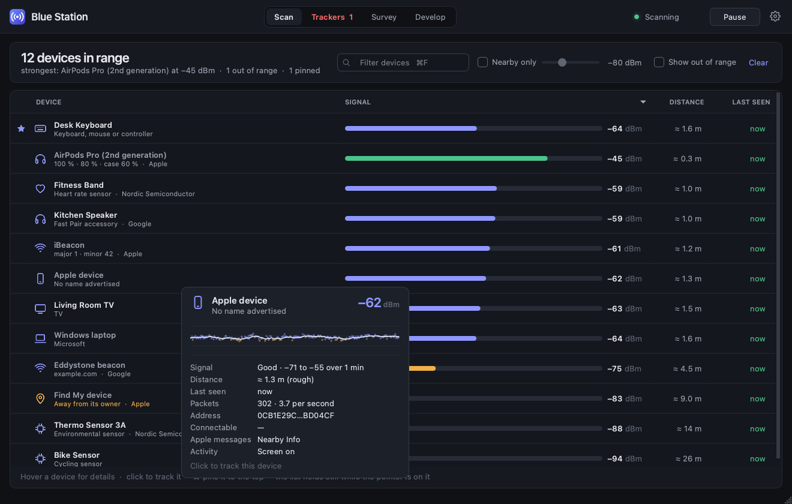
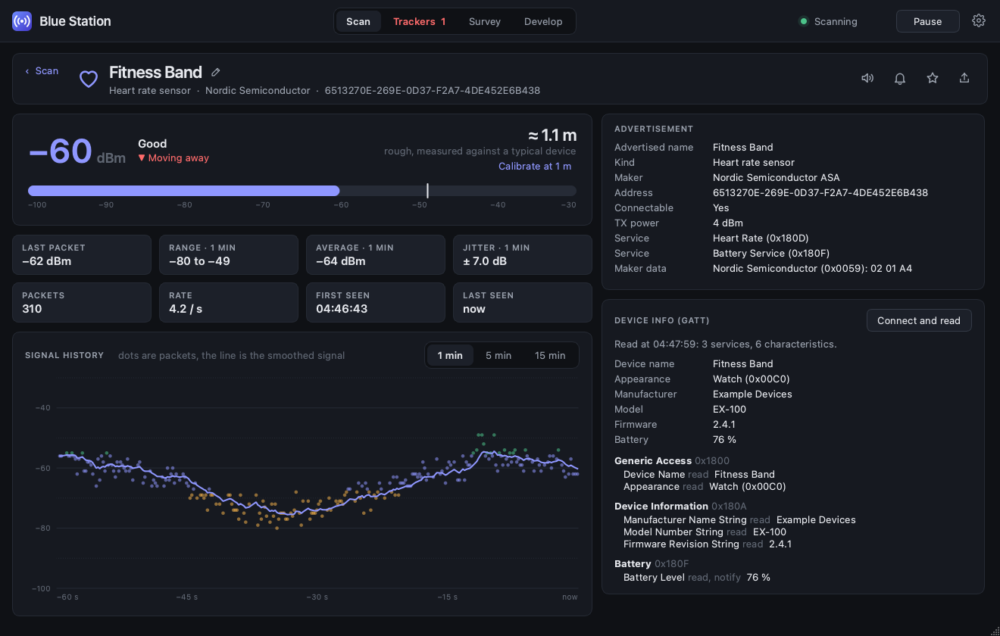
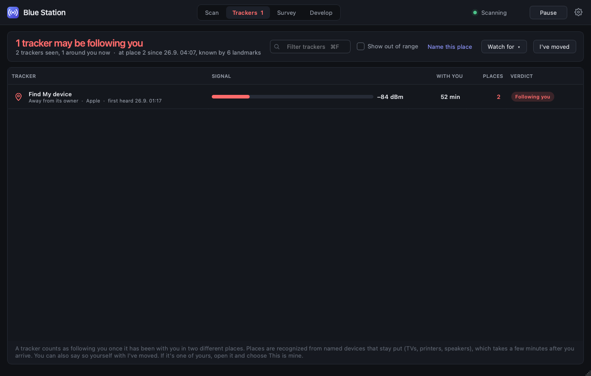
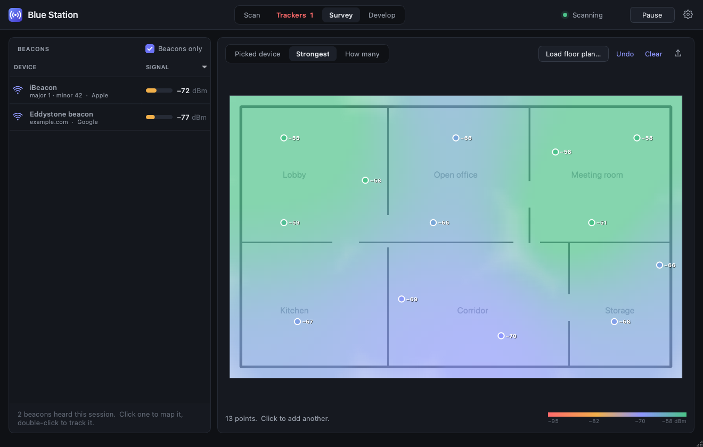
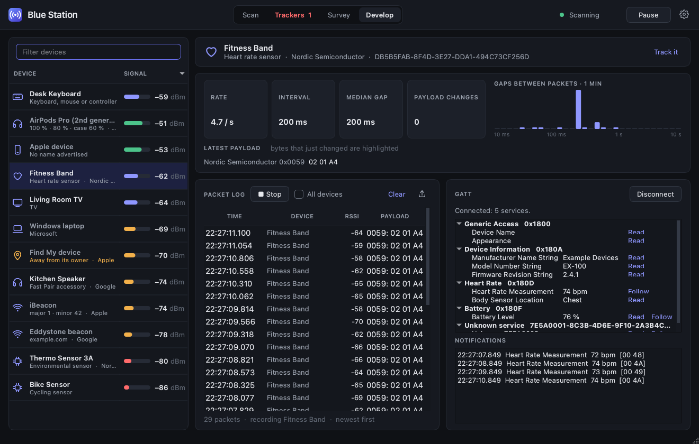

# Blue Station

A live Bluetooth Low Energy scanner, with one page per job. Pick the job
at the top and you get only what that job needs:

- **Scan**: every device around you, each with a live signal bar and
  the number beside it. Hover a device for its details.
- **Trackers**: AirTags and other item trackers, and whether one is
  following you.
- **Survey**: check that beacons are alive, and map coverage on a floor
  plan.
- **Develop**: one device, the way its firmware's author sees it:
  packet timing, payload changes, a packet log, and GATT with live
  notifications.

Clicking a device in any job opens its own page. There you can track it,
which helps you find something you've lost, and ask to be told when it
gets left behind. Closing the window leaves Blue Station watching from
the menu bar.



*The screenshots show the made-up devices of `blue-station --demo`.*

Built with Python, PySide6 (Qt) and [bleak](https://github.com/hbldh/bleak).

## Install & run

You need Python 3.10 or newer.

**As an app you start with `blue-station`**, from anywhere. The easiest
way is [pipx](https://pipx.pypa.io) (`brew install pipx` on macOS):

```bash
pipx install git+https://github.com/MrChillStorm/Blue_Station.git
blue-station
```

`pipx upgrade blue-station` gets each new release. To install one
particular version instead, add its tag to the end, like
`Blue_Station.git@v1.1.0`. pipx then keeps that version, and
`pipx upgrade` won't move it.

`blue-station --demo` fills the room with made-up devices, a made-up
morning for the tracker watch, and a heart rate strap to connect to. Use
it to try every job without Bluetooth.

**From a clone**, which is also what `Blue Station.app` uses:

```bash
git clone https://github.com/MrChillStorm/Blue_Station.git
cd Blue_Station
pip install -r requirements.txt
python3 -m blue_station
```

Or double-click **Blue Station.app** in the folder. It uses your
`python3`, so install the packages first. The app bundle has to
stay in this folder, because it starts the code next to it. If you
downloaded a ZIP and macOS refuses to open the app, right-click it and
choose Open once.

**Bluetooth permission (macOS).** The first scan makes macOS ask whether
the app may use Bluetooth. From the app bundle, it asks for *Blue
Station*. From a terminal, it asks for the terminal app instead. If you
said no, allow it in System Settings → Privacy & Security → Bluetooth
and press Scan.

Blue Station is built and used on macOS. bleak also works on Windows and
Linux, and the app is plain Qt, so it should run there too (⌘ means
Ctrl), but only macOS has been tried.

## In the menu bar

Closing the window doesn't quit. Blue Station keeps watching for
trackers and for your alerts behind a small icon in the menu bar (the
app icon's rounded square with the waves cut out). A red badge on the
icon counts the devices that may be following you. Clicking Blue
Station in the Dock opens the window again.
When the menu bar is full, or on a display with a notch, macOS hides
the icons that don't fit. Its menu opens the window again, pauses scanning, and
quits, and so does ⌘Q. Starting Blue Station again while it's there
brings the window back. **Keep watching in the menu bar** in the gear
menu turns this off.

**Start at login**, in either menu, starts Blue Station in the menu bar
when you log in (macOS). It adds a LaunchAgent
(`~/Library/LaunchAgents/io.github.mrchillstorm.bluestation.plist`) and
a small app next to your settings, which runs the same Python and Blue
Station you turned it on from. After moving either, turn it off and on
again. macOS lists it under System Settings → General → Login Items, and
may ask about Bluetooth once more the first time.

## Scan

Everything heard in the last 30 seconds, strongest first.

- **What each device is and who made it**, from its name, its services
  and the maker's data in its packets. For example: AirPods and Beats
  with their battery levels, iBeacons with their major and minor,
  Eddystone beacons with their URL and battery, Find My devices, Tile,
  SmartTag and Google tags, Windows PCs, Fast Pair accessories, heart
  rate straps, cycling sensors.
- **A live signal bar and its number** in dBm. Green is excellent (−55
  and up), blue good, amber fair, red weak (below −80). The number is
  smoothed over about a second and a half, so it follows you without
  flickering.
- **A rough distance**, and when a packet was last heard. Devices that
  go quiet fade out. **Show out of range** keeps them listed.
- **Nearby only** hides devices weaker than the signal set on the
  slider beside it, for busy places: roughly −60 dBm is close by in the
  same room, −80 (where it starts) the next room, and −90 and weaker
  far away. Pinned devices stay.

**Hover** a device for its card: the last minute of signal as a
sparkline, packets per second, the address, services and anything
decoded. While the pointer is over the list, **the order holds still**,
so a row never jumps away from your click. **☆** pins a device to the
top, and Blue Station remembers it.

## A device's own page



- **A big live signal with its trend**: *Getting closer*, *Moving away*
  or *Holding steady*. To find something, walk around and follow the
  green.
- **Rough distance.** **Calibrate at 1 m** makes it much better for
  that device: hold it a metre away for a few seconds and click.
- **Statistics, and the signal's history** over 1, 5 or 15 minutes.
  Point at the chart to read any packet.
- **The advertisement**, raw and decoded.
- **Connect and read** fetches the standard information: name, maker,
  model, serial number, firmware and battery.
- **The speaker button** beeps while you search: faster, and a little
  higher, as the signal gets stronger. Walk towards the faster beeps and
  look at the room instead of the screen.
- **The bell** sends a notification when the device goes out of range
  (did you leave your bag behind?) or comes back in range. Only
  scanning counts: pausing, Bluetooth going off or the Mac sleeping
  isn't the device leaving, and one on the edge of range alerts at most
  every 5 minutes.
- The **pencil** gives it a name of your own, and **Export** saves its
  signal log as CSV.

## Trackers



Item trackers around you: AirTags and other Find My devices away from
their owner, Tile, SmartTag, Chipolo and Google's tags. Each one shows
how long it has been with you, in how many places, and a verdict:
*Passing by*, *Staying near you* (20 minutes in one place, like a
neighbour's tag) or **Following you**.

- **Following you** means it has been with you in two different places.
  Then the job button turns red, the status bar says so, and macOS
  shows a notification. Click the tracker to find it with its own page.
- **Places without GPS.** A laptop has no GPS, so Blue Station
  recognizes places by their **landmarks**: named devices that stay put,
  like TVs, printers and speakers. When most of the landmarks around you
  are new, you've moved. That takes a few minutes after you arrive, and
  **I've moved** tells it straight away. A named device that came along
  from the last place, like your phone, can't describe a place, so it
  stops being used as a landmark. That's all it changes: it's still
  watched like any other device. Only you can say a device is yours,
  with **This is mine**.
- While you're between places, nothing is credited to a place. So a
  stranger's tag at a café can't be blamed on your home before the café
  is recognized.
- **Out of range** trackers (not heard for 30 seconds) are left out,
  unless they may be following you. **Show out of range** lists them
  all.
- **The filter** (⌘F) finds trackers by name, kind, maker or address,
  like the Scan page's, and also by verdict and by the places they were
  with you.
- **It watches in the background**, whichever job is on screen and
  from the menu bar after you close the window. It remembers what it
  has seen across restarts: trackers for 48 hours (AirTags away from
  their owner keep their address for a day), places for 60 days, and
  places you've named for good.
- **Name this place** calls the place you're at *Home* or *Office*
  instead of a number. A device's own page then shows where and when it
  was with you, like *Home 8:05–8:40 · unknown place 8:40–9:05 · Office
  9:10–now*, and pointing at its number of places shows the same.
  *Unknown place* is time with you before a place was recognized, or on
  the way between places.
- **Watch for** adds other kinds of device: headphones and earbuds,
  watches, bands and health devices, phones and tablets, or anything
  else that could travel. TVs, speakers and beacons stay put, so they're
  never watched. Most phones, AirPods and watches change their Bluetooth
  address every 15 minutes or so, so they can't be followed from place
  to place. Devices that keep their address can, like many fitness
  bands, cheap earbuds and GPS trackers. Devices of those kinds that
  only passed by are forgotten after 3 hours.
- **This is mine**, on a device's own page, leaves one of your own
  devices alone. **Watch my devices again** in the Watch for menu undoes
  it for all of them.

## Survey



- **The beacon list** keeps every beacon heard this session. One that
  stops broadcasting stays listed as *quiet*, so a dead battery shows up
  while you walk. Untick **Beacons only** to survey any device.
- **The map.** Load a floor plan (any image: a plan, a sketch, a photo
  of the evacuation map), or work on the blank grid. Click where you
  stand and hold still for five seconds. The next five seconds of
  packets become a point. Repeat around the space. ⌘Z takes the last
  point back.
- **What the map shows**, switchable at any time, because every point
  keeps every device's reading:
  - **Picked device**: one device's signal (click it in the list).
  - **Strongest**: the best signal of the listed devices at each spot.
    This shows coverage holes.
  - **How many**: how many listed devices are heard at −85 dBm or
    better. Three or more is what indoor positioning usually needs.
- The colors fade away from where you measured, so the map never claims
  more than you walked. **Export** saves the map as PNG or the points as
  CSV.

## Develop



Pick a device on the left.

- **Packets**: rate, the shortest common gap and the median gap between
  heard packets, how often the payload changes, and a histogram of the
  gaps. macOS passes on only some of a device's packets, so the real
  advertising interval is the shortest gap or shorter. A Mac can't see
  intervals much under half a second.
- **Latest payload**, with the bytes that just changed highlighted.
  Counters and sensor values stand out at a glance.
- **Packet log**: off until you press **Record**, so nothing piles up.
  It records this device (or **All devices**) exactly as heard, keeps
  the last 100 000 packets, and exports to CSV. The table follows the
  newest packets while it's scrolled to the top.
- **GATT**: **Connect** and stay connected. Browse every service,
  **Read** any characteristic, and **Follow** notifications live.
  Heart rate, battery, temperature and other standard values are
  decoded, and everything else shows as hex. Reading a protected
  characteristic may make macOS ask to pair.

## Good to know

- Distances are rough. Walls, bodies and pockets easily halve or double
  them. The trend and the signal itself are the reliable parts.
- macOS passes on each device's packets about once or twice a second.
  How often depends on the device, and not on whether Blue Station is
  in front or the Mac is on battery. So "live" means about once a
  second: plenty for finding things and watching trends.
- Phones and many other devices change their Bluetooth address every
  few minutes for privacy, so one phone can show up as several devices
  over an afternoon.
- macOS shows each device under an address of its own making (a UUID
  that's the same only on your Mac). Where it can, Blue Station also
  shows the real Bluetooth address.
- The AirPods, Find My, Apple activity and Windows readings come from
  community research, not from published specifications. They are good
  hints, not guarantees. The same goes for the tracker verdicts. A
  *Following you* is worth checking, and it's no proof.

## Keys

| Keys | Does |
|---|---|
| ⌘1 – ⌘4 | Scan, Trackers, Survey, Develop |
| Space | Scan or pause |
| ⌘F | Filter the list |
| Enter | Open the selected device |
| Esc | Back from a device, or clear the filter |
| ⌘Z | Take back the last survey point |
| ⌘E | Export what's on screen |

The gear menu has the appearance (dark by default, light, or following
the system), **Keep watching in the menu bar**, **Start at login**,
**Export device list…**, **Clear list** and help.

## Your data

Nothing is recorded unless you export it, except two small files kept in
your system's usual place for app data:

- `settings.json`: settings, and the names, pins, calibrations and
  alerts you give devices.
- `trackers.json`: the tracker watch's memory, meaning which trackers
  it has seen and when, which devices you said are yours, and your
  places: their landmarks (the per-Mac IDs of named devices) and the
  names you give them. Nothing else about where you are. **Forget history…** in the Trackers page's Watch for menu empties it,
  except for which devices are yours.

| System | Folder |
|---|---|
| macOS | `~/Library/Application Support/Blue Station` |
| Windows | `C:\Users\<you>\AppData\Local\Blue Station` |
| Linux | `~/.local/share/Blue Station` (or `$XDG_DATA_HOME/Blue Station`) |

Set `BLUE_STATION_SETTINGS=/some/other.json` to use another settings
file. `trackers.json` then goes next to it.

## Development

```bash
pip install -e .                     # the `blue-station` command, running this checkout
python3 -m unittest discover tests   # core and interface tests (offscreen, no Bluetooth needed)
python3 packaging/build_icon.py      # rebuild the app icon after editing packaging/icon.svg
```

- `blue_station/core/` has no Qt:
  - `scanner.py`: bleak on a background thread, and the demo
  - `devices.py`: each device's history, smoothing, statistics, distance, trend and packet gaps
  - `decode.py`: what an advertisement says (kinds, makers, beacons, Apple, Microsoft...)
  - `watch.py`: trackers, places and landmarks, and each device's timeline
  - `alerts.py`: out of range and back again, for the devices you asked about
  - `survey.py`: survey points and the map's estimate
  - `packets.py`: the packet log
  - `gatt.py`: the quick read, and the lasting connection with notifications
  - `names.py`: Bluetooth SIG names for companies, services and characteristics
  - `prefs.py`: the settings files
  - `login.py`: starting at login on macOS
- `blue_station/ui/` is the PySide6 interface:
  - `devices.py` (Scan), `trackers.py`, `survey.py`, `develop.py` and `track.py` (a device's own page)
  - `window.py`, `menubar.py`, `widgets.py`, `theme.py` and `icons.py`: everything around them
  - `sound.py`: the beep for finding a device
