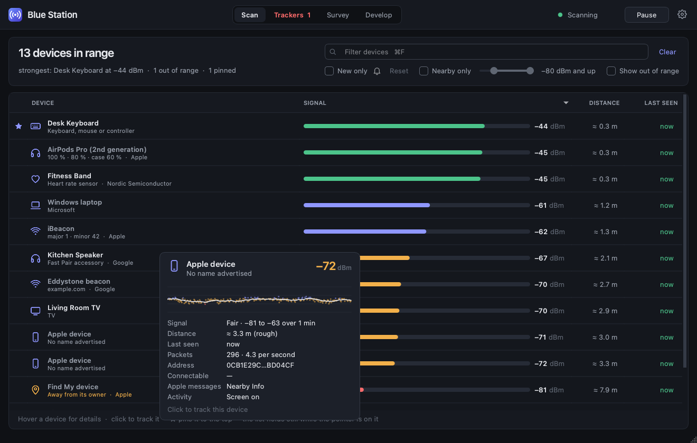
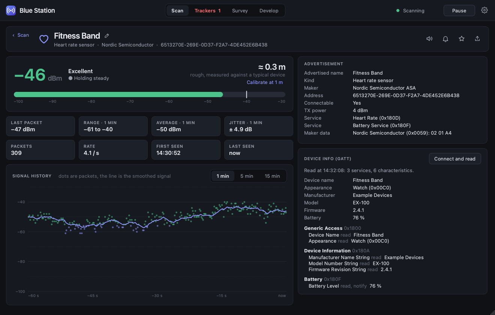
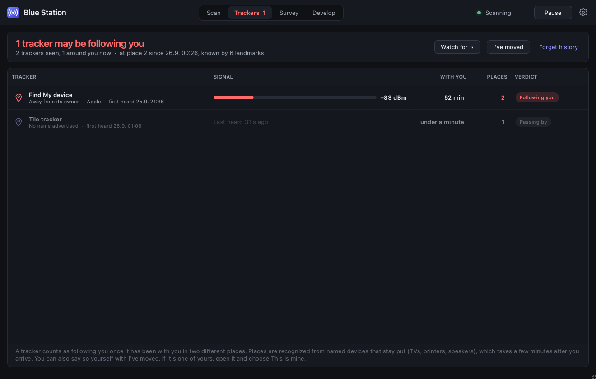
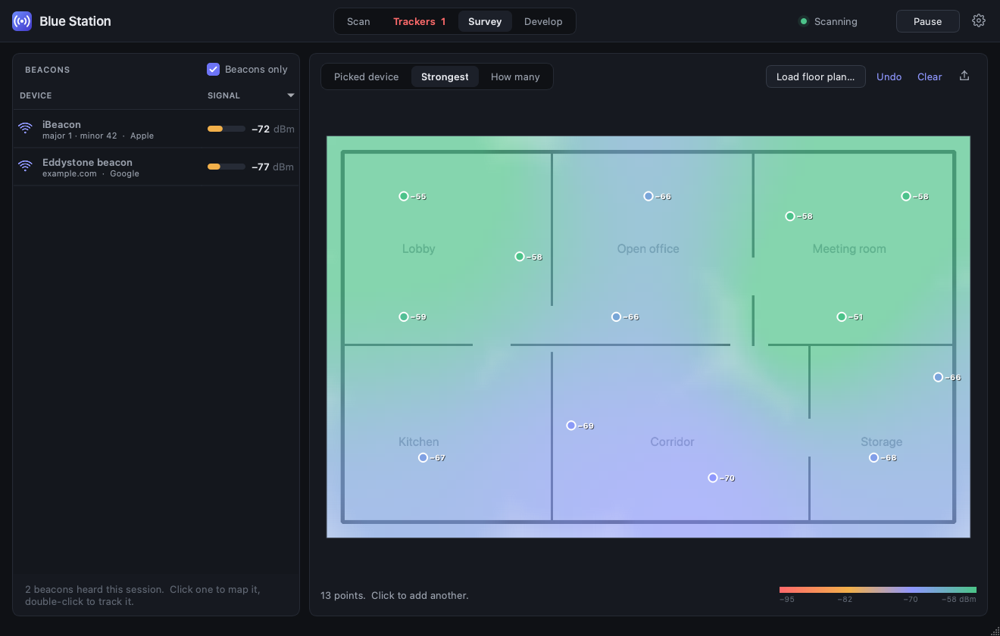
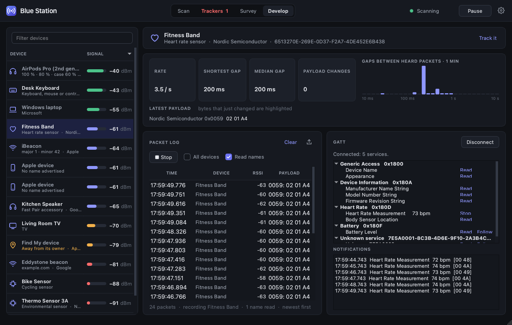

# Blue Station

A live Bluetooth Low Energy scanner, with one page per job. Pick the job
at the top and you get only what that job needs:

- **Scan**: every device around you, each with a live signal bar.
- **Trackers**: AirTags and other item trackers, and whether one is
  following you.
- **Survey**: check that beacons are alive, and map coverage on a floor
  plan.
- **Develop**: one device, the way its firmware's author sees it, and a
  packet log for studying what's around you.

Clicking a device in any job opens its own page, where you can find it
by its signal and ask to be told when it gets left behind. Closing the
window leaves Blue Station watching from the menu bar.



*The screenshots show the made-up devices of `blue-station --demo`.*

How it works inside, and working on the code: [DEVELOPMENT.md](DEVELOPMENT.md).

## Install

You need Python 3.10 or newer, and [pipx](https://pipx.pypa.io)
(`brew install pipx` on macOS):

```bash
pipx install git+https://github.com/MrChillStorm/Blue_Station.git
blue-station
```

- `pipx upgrade blue-station` gets each new release. (To stay on one
  version instead, install it with its tag at the end, like
  `Blue_Station.git@v1.6.0`; `pipx upgrade` then leaves it alone.)
- `blue-station --demo` fills the room with made-up devices, so you can
  try every job without Bluetooth.
- The first scan makes macOS ask whether it may use Bluetooth. If you
  said no, allow it in System Settings → Privacy & Security → Bluetooth
  and press Scan.

Blue Station is made on macOS. It should also run on Windows and Linux
(⌘ means Ctrl there), but only macOS has been tried.

## In the menu bar

Closing the window doesn't quit. Blue Station keeps watching for
trackers, your alerts and new devices behind a small icon in the menu
bar. A red badge on it counts the devices that may be following you.
Its menu opens the window, pauses scanning and quits (so does ⌘Q), and
clicking Blue Station in the Dock brings the window back too. **Keep
watching in the menu bar**, in the gear menu, turns this off. When the
menu bar is full, or on a display with a notch, macOS hides the icons
that don't fit.

**Start at login**, in either menu, starts Blue Station in the menu bar
when you log in. macOS lists it under System Settings → General → Login
Items.

## Scan

Everything heard in the last 30 seconds, strongest first.

- **What each device is and who made it**: AirPods with their battery
  levels, beacons, Find My devices and other tags, Windows PCs, heart
  rate straps, and many more.
- **A live signal bar and its number** in dBm. Green is excellent (−55
  and up), blue good, amber fair, red weak (below −80). The number is
  steadied, so it doesn't jump about while nothing moves.
- **A rough distance**, and when it was last heard. Devices that go
  quiet fade out; **Show out of range** keeps them listed.
- **One device, even when its address changes.** Phones, AirPods and
  watches change their Bluetooth address every 15 minutes or so, for
  privacy. Blue Station follows the change when it hears it, so the
  device stays one row with its history, name and pin. Its card says how
  sure it is. A phone whose change it missed comes back as a new device.
- **One device, whatever it sends.** A Mac or an Apple TV sends several
  kinds of advertisement. Blue Station learns which go together and
  lists them once; the device's card lists them all.
- **Nearby only** shows just the devices within the signal range you set
  on its slider: about −60 is the same room, −80 the next room. Pull the
  right handle in to hide your own devices right next to you too.
- **New only** shows just the devices that turn up from now on, like
  something just brought into the room. Its **bell** tells you about
  each one, and **Reset** starts over from now.

**The filter** (⌘F) matches names, kinds, makers and addresses. A minus
leaves out what matches: `-apple -tv` hides Apple devices and TVs.
**Hover** a device for its card, with its last minute of signal. **☆**
pins a device to the top.

## A device's own page



- **A big live signal with its trend**: *Getting closer*, *Moving away*
  or *Holding steady*. To find something, walk around and follow the
  green.
- **The speaker button** beeps faster as the signal gets stronger, so
  you can look at the room instead of the screen.
- **Calibrate at 1 m** makes the distance much better for that device:
  hold it a metre away for a few seconds and click.
- **The bell** tells you when the device goes out of range (did you
  leave your bag behind?) or comes back.
- **Connect and read** fetches its name, maker, model, serial number,
  firmware and battery.
- **The signal's history**, **statistics** and **the advertisement**,
  raw and decoded. The **pencil** gives the device a name of your own,
  and **Export** saves its signal log.

## Trackers



Item trackers around you: AirTags and other Find My devices away from
their owner, Tile, SmartTag, Chipolo and Google's tags. Each shows how
long it has been with you, in how many places, and a verdict:

- **Passing by**.
- **Staying near you**: 20 minutes in one place, like a neighbour's tag.
- **With you on the move**: with **Coordinates** on, with you for 15
  minutes while your phone says you're moving, over a kilometre. Worth
  a look, though on a bus or a train everyone around you is. It stays
  until you forget it (**Forget the ones with you on the move**, in the
  Watch for menu).
- **Following you**: with you for 10 minutes, in two different places.
  The menu bar icon turns red, and a notification says so. Click the
  tracker to find it with its own page. Devices it knows stay put, the
  ones it recognizes your places by, never count as following, even
  when heard from a place nearby.

**How it knows where you are.** With **Coordinates** on (Develop), your
phone's position says so: moving, you're between places; stopped for 2
minutes near a place you've been, you're there; stopped for 5 minutes
somewhere new, that's a new place. Without it, a laptop has no GPS, so
Blue Station recognizes places by the named devices around you that stay
put, like your neighbours' TVs and printers: somewhere new becomes a
place once you've stayed about 5 minutes, and a place it knows is
recognized after about 3. Places learn those devices while your phone
tells where you are, so they're known again without it. **I've moved**
tells it straight away. **Name this place** calls it *Home* or *Office*,
and a tracker's page then shows where and when it was with you, like
*Home 8:05–8:40 · Office 9:10–now*.

- **Watch for** adds other kinds of device that could travel with you:
  headphones, watches and bands, phones and tablets, or anything else.
  Devices that keep their address are the easiest to follow.
- **This is mine**, on a device's own page, leaves one of your own
  devices alone.
- **Forget it**, on a device's own page, and **Forget the ones following
  you**, in the Watch for menu, start them over: for ones you've checked
  and aren't worried about.
- **It watches in the background**, whichever page is showing and from
  the menu bar, and remembers what it saw across restarts.
- **Show out of range**, **hover** and **the filter** work like the Scan
  page's; the filter also finds verdicts and places.

## Survey



- **The beacon list** keeps every beacon heard. One that stops
  broadcasting stays listed as *quiet*, so a dead battery shows up while
  you walk. Untick **Beacons only** to survey any device.
- **The map.** Load a floor plan (any image, even a photo of the
  evacuation map), or use the blank grid. Click where you stand and hold
  still for five seconds; the next five seconds of packets become a
  point. Repeat around the space. ⌘Z takes the last point back.
- **What the map shows**: one device's signal, the strongest signal at
  each spot (coverage holes), or how many devices are heard well (three
  or more is what indoor positioning usually needs). The colors fade
  away from where you measured. **Export** saves the map or the points.

## Develop



Pick a device on the left.

- **Packets**: how often it's heard, the gaps between packets, and how
  often its payload changes. **Latest payload** highlights the bytes
  that just changed, so counters and sensor values stand out.
- **Packet log**: off until you press **Record**. It keeps this device's
  packets (or **All devices**') exactly as heard, and exports them as a
  spreadsheet (CSV). While it records, the Mac stays awake, on battery
  too; closing the lid still puts it to sleep.
- **Read names**, while recording, asks each device that allows it who
  it is (maker and model), once. It's public information: nothing that
  needs pairing, and nothing is changed. Handy for checking Blue
  Station's own guesses about address changes.
- **Coordinates** adds where you were to every packet, from your phone,
  and tells Trackers where you are. It stays on until you untick it:
  1. Install **OwnTracks** on the phone (free, iPhone and Android), and
     join the phone's Personal Hotspot with the Mac.
  2. Tick **Coordinates**, and press **Link for phone**. It copies this
     Mac's address, like `http://172.20.10.2:8765/abcdef` (the status
     bar shows it too). On the same Apple Account, what the Mac copies
     pastes on the iPhone.
  3. On the phone, paste it into the browser's address bar, and on the
     page it opens, tap **Set up OwnTracks**. When OwnTracks' welcome
     asks you to set up a server: Blue Station is that server, so
     there's nothing else to set up. If OwnTracks says *URI or file
     configuration not allowed*, turn on **Allow external
     configuration** in it (ⓘ on the map → Settings → the ⓘ at the end
     of Remote Control), tap the button again, and turn it back off.

  The row shows how old the phone's latest position is, and the table a
  WHERE column with each packet's. In the iPhone's Settings → OwnTracks
  → Location, choose **Always**, or it stops sending once the phone is
  locked. The phone may also ask whether OwnTracks may connect to
  devices on your local network, and macOS whether Python may accept
  incoming connections: allow both, that's the positions arriving. **Add
  track…** does the same afterwards from a GPS track (GPX) saved by any
  app.
- **GATT**: **Connect**, browse every service, **Read** any value, and
  **Follow** its notifications live. Heart rate, battery and other
  standard values are decoded. Protected ones make macOS ask to pair.

## Good to know

- Distances are rough: walls, bodies and pockets easily halve or double
  them. The trend and the signal itself are the reliable parts.
- "Live" means about once a second. macOS passes on most devices'
  packets every second or two, and Find My devices' only every 10
  seconds or so.
- Tracker verdicts, device kinds and address changes are well-founded
  guesses, not proof. A *Following you* is worth checking.
- The addresses Blue Station shows are macOS's own (the same only on
  your Mac), not the devices' real Bluetooth addresses.
- Blue Station's notifications come through macOS as Script Editor's,
  so their sound settings are under Script Editor in System Settings →
  Notifications.

## Keys

| Keys | Does |
|---|---|
| ⌘1 – ⌘4 | Scan, Trackers, Survey, Develop |
| Space | Scan or pause |
| ⌘F | Filter the list |
| Enter | Open the selected device |
| Esc | Back from a device, or clear the filter |
| ⌘Z | Take back the last survey point |
| ⌘E | Export what's on screen |

The gear menu has the appearance (dark, light, or following the
system), **Keep watching in the menu bar**, **Start at login**, **Export
device list…**, **Clear list** and help.

## Your data

Nothing leaves your Mac, and nothing is recorded unless you export it,
except two small files in `~/Library/Application Support/Blue Station`
(on Windows `AppData\Local\Blue Station`, on Linux
`~/.local/share/Blue Station`):

- `settings.json`: your settings, and the names, pins, calibrations and
  alerts you give devices.
- `trackers.json`: the tracker watch's memory: which trackers it has
  seen and when, which devices are yours, and your places, known only
  by the devices around them. Where a place is, from your phone, is
  kept only while Blue Station runs. **Forget history…** in the Trackers
  page's Watch for menu empties it.

**Start at login** also adds a login item
(`~/Library/LaunchAgents/io.github.mrchillstorm.bluestation.plist`) and
a small app next to these files. Turning it off removes them.

A packet log you export holds the names of the devices around you, your
neighbours' too, and with Coordinates, where each was heard. Keep it to
yourself.
